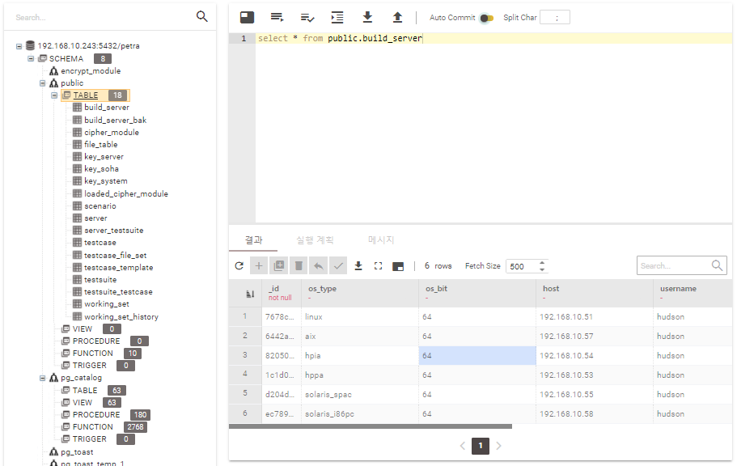

# Petra DataStudio 알파 테스트 시작.

Petra DataStudio의 알파 테스트가 2020-09-25 부터 시작되었습니다.

> 알파 테스트 페이지는 192.168.10.x 대역으로의 접속만 허용됩니다.

- [Release Note 보러가기]()

- [사용하기](http://ds.sinsiway.com/petra/init.do)

## 주요 기능

### 1. 클라이언트 설치가 필요없는 데이터베이스 질의어 사용.

별도의 클라이언트 설치 없이 Chrome Web Browser를 사용하여 데이터베이스 데이터 조회가 가능합니다.
</img> 
